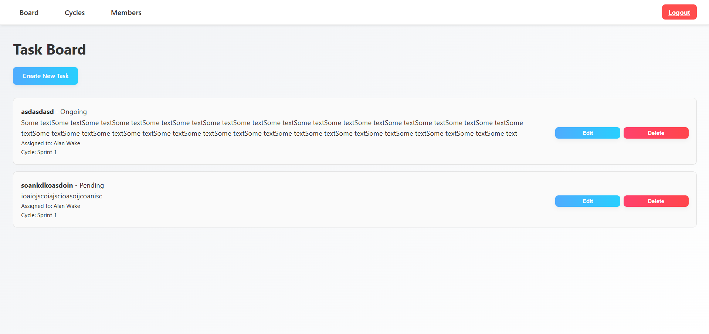
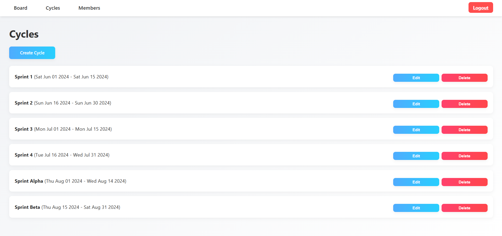
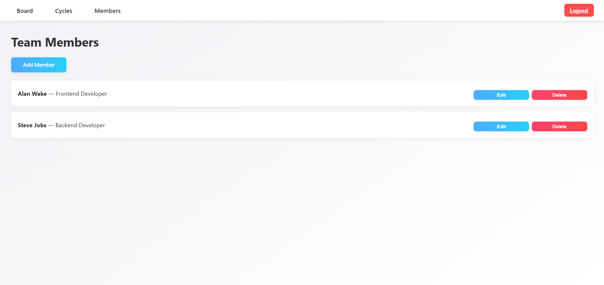

# README – Task Manager (Node + Express 5 + MongoDB + Electron)

> **Język projektu / dokumentacji:** PL  
> **Autor:** Danylo Maksymenko  
> **Licencja:** MIT

---

## 1 • Opis

Task Manager to aplikacja do planowania i śledzenia pracy zespołu w krótkich cyklach (ang. _cycle_) przypominających sprinty. Każde zadanie (_Board Item_) można przypisać do członka zespołu (_Member_), powiązać z cyklem oraz monitorować jego status → _Backlog → In Progress → Done_.  
Aplikacja działa:

- jako **strona www** na `http://localhost:3000`,
- jako **aplikacja desktop** (Electron) – otwiera tę samą instancję serwera w natywnym oknie.

---

## 2 • Funkcjonalności

| Obszar                    | Możliwości                                                                                                                           |
| ------------------------- | ------------------------------------------------------------------------------------------------------------------------------------ |
| **Zadania (Board Items)** | • tworzenie / edycja / usuwanie<br>• status → _todo_ / _in-progress_ / _done_<br>• przypisywanie do członka<br>• przypięcie do cyklu |
| **Cykle (Cycles)**        | • definiowanie zakresu dat<br>• edycja nazw i dat<br>• przenoszenie zadań między cyklami                                             |
| **Członkowie (Members)**  | • dodawanie, edycja, usuwanie<br>• rola lub specjalizacja (tekstowa)                                                                 |
| **Widok tablicy**         | • kolumny Kanban (drag-&-drop w planach)<br>• filtry po cyklu / osobie                                                               |
| **Eksport**               | • lista zadań do CSV (road-mapa) — _wkrótce_                                                                                         |
| **Desktop (Electron)**    | • uruchamia serwer Node w tle<br>• automatyczne otwarcie okna po starcie                                                             |

---

## 3 • Wymagania

| Narzędzie | Wersja (min) |
| --------- | ------------ |
| Node.js   | 18 LTS       |
| npm       | 9            |
| MongoDB   | 6            |
| Git       | dowolna      |

---

## 4 • Instalacja & uruchomienie

```bash
git clone https://github.com/danil-maksimenko/Task-manager
cd Task-manager

# 1. Instalacja zależności
npm install                      # prod + dev

# 2. Konfiguracja środowiska
cp .env.example .env             # wypełnij URI_MONGODB, PORT itp.

# 3. Uruchom serwer z autoreloadem
npm run dev                      # http://localhost:3000

# 4. (opcjonalnie) tryb desktop
npm run electron:local           # odpali API + okno Electron
```

**Skróty npm**

| Komenda                  | Co robi                                      |
| ------------------------ | -------------------------------------------- |
| `npm run dev`            | `NODE_ENV=development` + _nodemon server.js_ |
| `npm start`              | produkcyjny backend bez autoodświeżania      |
| `npm run electron:local` | równolegle: backend + Electron (okno)        |

---

## 5 • Konfiguracja `.env`

```dotenv
# przykładowa konfiguracja
PORT=3000
URI_MONGODB=mongodb://localhost:27017/task_manager_db
# TOKEN_SHUTDOWN opcjonalnie, jeśli blokujesz /kill
```

---

## 6 • Użyte biblioteki

| Pakiet                                            | Rola                  |
| ------------------------------------------------- | --------------------- |
| `express 5`                                       | routing, middleware   |
| `ejs`                                             | server-side rendering |
| `mongoose`                                        | ODM do MongoDB        |
| `dotenv`                                          | zmienne środowiskowe  |
| **Dev only**                                      |
| `nodemon`, `concurrently`, `wait-on`, `cross-env` | komfort pracy         |
| `electron`                                        | wrapper desktop       |

---

## 7 • Struktura katalogów

```
├─ app
│  ├─ models          # Mongoose Schemas
│  │   ├─ BoardItem.js
│  │   ├─ Cycle.js
│  │   └─ Member.js
│  ├─ services        # logika dostępu do DB
│  ├─ controllers     # obsługa żądań
│  ├─ routes          # definicje endpointów
│  └─ views
│      ├─ layout.ejs
│      └─ pages/…
├─ public             # CSS / JS / img
├─ config
│  └─ database.js
├─ main.js            # Electron entry
├─ server.js          # Express entry
└─ README.md
```

---

## 8 • Architektura

```
Browser / Electron ↔ Express Router ↔ Controller ↔ Service ↔ Mongoose ↔ MongoDB
                             ↕
                          EJS View
```

- **Controllers** – cienkie; walidacja wejścia, wybór widoku.
- **Services** – CRUD + drobna logika (np. przeliczanie statusów).
- **Models** – definicje schematów + proste metody statyczne.

---

## 9 • Zrzuty ekranu / mock-ups




